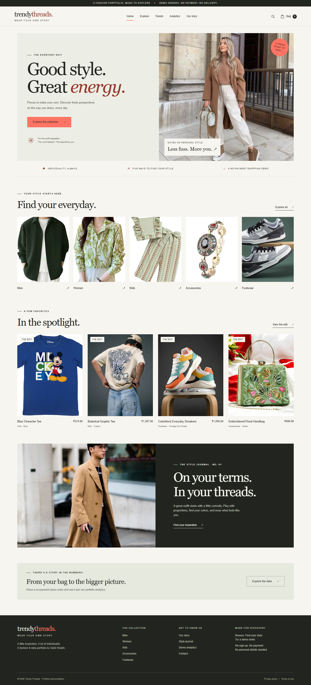
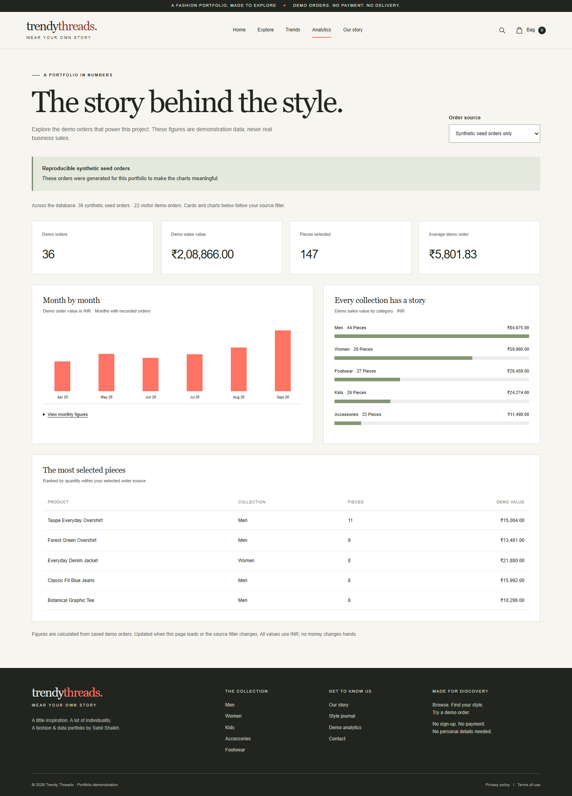

# Trendy Threads

A fashion catalog and data engineering portfolio built from the original Trendy Threads pages and photography. Browse 86 products (25 existing curated products plus all 61 supplied retailer listings), filter the catalog, keep a bag in browser storage, place a no-payment demo order, and see SQL-backed analytics update. Source pages yielded verified details for 42 listings, including 42 real product images and 30 recovered/current prices; 47 imported listings can be ordered, while 14 listings without a verified price remain visible but cannot be checked out.

**Demo only. No real shop, account, inventory, payment, customer details, or delivery.** Prices, available sizes and colors, and synthetic orders are illustrative. Visitor orders are demonstrations and are never actual sales.

## Stack and flow

- Static storefront: accessible HTML, responsive CSS, and vanilla JavaScript in `public/`; original local photos are preserved, verified retailer CDN images are HTTPS/allowlisted, and failed image loads use a local placeholder.
- API: Python 3.13+ Cloudflare Worker using the supported `pywrangler` tool.
- Database: Cloudflare D1 (SQLite). Migrations create `products`, `source_products`, `orders`, and `order_items`, plus a unified catalog view. Prices and order totals use integer paise; source products with no supplied price stay unpriced and are rejected by checkout.
- Data prep: standard-library Python validates the original curated CSV and the supplied retailer JSON, then produces repeatable SQL imports and import reports.

`data/catalog_raw.csv` → `python scripts/clean_catalog.py` → original curated product seed; `data/trendy_threads_products_source.json` → `python scripts/import_source_catalog.py` → verified source images/details/prices plus still-incomplete listings and an audit report → unified Python product API → saved visitor demo orders → SQL analytics API. A second, fixed SQL seed creates explicitly **synthetic** monthly fixtures. The [data flow and schema notes](docs/data-flow.md) describe provenance, missing values, fixtures, and aggregates; [API details](docs/api.md) document endpoints and checkout guarantees.

## Run on Windows

Install Node.js 22+, Python 3.13+, and the free `uv` tool. Install Google Chrome for browser tests. From the project folder in PowerShell:

```powershell
python -m pip install uv
uv sync --locked
npm ci
python scripts/clean_catalog.py --check
python scripts/import_source_catalog.py --check
```

Initialize this checkout's local D1 database and start the Python Worker with Workers Static Assets:

```powershell
.\scripts\worker.ps1 d1 migrations apply trendy-threads-db --local
.\scripts\worker.ps1 d1 execute trendy-threads-db --local --file=data/catalog_seed.sql
.\scripts\worker.ps1 d1 execute trendy-threads-db --local --file=data/source_products_seed.sql
.\scripts\worker.ps1 d1 execute trendy-threads-db --local --file=data/synthetic_orders.sql
.\scripts\worker.ps1 dev --ip 127.0.0.1 --port 8787
```

Open [http://127.0.0.1:8787](http://127.0.0.1:8787). Keep the Worker running while you use the local site. The project-local launcher adds an existing `.tools/bin/uv.exe` to the temporary command path when available; `uv` can instead be installed normally. `wrangler.jsonc` points to the existing `trendy-threads-db` database. Local D1 state remains in the ignored `.wrangler/` folder and is not committed.

## Checks

```powershell
python -m unittest discover -s tests -v
python scripts/clean_catalog.py --check
python scripts/import_source_catalog.py --check
python scripts/audit_site.py
node --check public/js/app.js
npm run test:browser
npm run test:api
```

Python tests use only the standard library and an in-memory SQLite database. Playwright runs the pages in installed Chrome against the local Worker, including product search/filter/sort, image and link checks, mobile layout, cart storage, checkout, a lost-response retry, and confirmation that retry creates no second order. Its API smoke script also submits **one new visitor demo order per run** to the selected Worker and verifies analytics. Run it against a different deployment with `python scripts/smoke_api.py --base-url https://your-worker.workers.dev`.

Representative storefront screenshots:






## Existing Cloudflare account and deployment

The current `wrangler.jsonc` binds the existing `trendy-threads-db`; do not create another database. Install dependencies and sign in once with Cloudflare's browser login if Wrangler asks. Apply the migrations and imports in order:

```powershell
.\scripts\worker.ps1 login
.\scripts\worker.ps1 d1 migrations apply trendy-threads-db --remote
.\scripts\worker.ps1 d1 execute trendy-threads-db --remote --file=data/catalog_seed.sql
.\scripts\worker.ps1 d1 execute trendy-threads-db --remote --file=data/source_products_seed.sql
.\scripts\worker.ps1 d1 execute trendy-threads-db --remote --file=data/synthetic_orders.sql
.\scripts\worker.ps1 deploy
```

All seed statements are repeatable; product rows are upserted and fixed synthetic orders are preserved on reimport. These commands use the already configured Cloudflare account and database, and the default `workers.dev` address; they do not configure a paid plan, custom domain, payment service, or secret. Static assets and the Python API are served by the deployed Worker, so the local computer does not need to remain on.

**Deployment status:** The 86-product catalog is live at [trendy-threads.sk73sahil.workers.dev](https://trendy-threads.sk73sahil.workers.dev). The existing D1 database contains 72 orderable products (25 original and 47 imported), 14 imported listings whose prices could not be verified, and 36 synthetic demo orders. Of 61 imported listings, 42 have retailer-page-verified prices and HTTPS listing images; images load from their retailer CDNs and fall back to local placeholder artwork if unavailable. The deployed public site passed all 10 Chrome/Playwright production checks, including catalog filters, images, checkout retry/idempotency, analytics, and 404 handling. Browser verification also created visitor demo orders; no real payments are processed.
