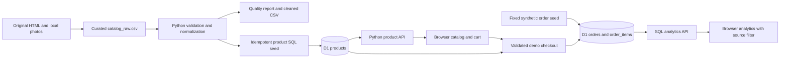

# Catalog and demo order data

Trendy Threads uses one SQL catalog for every storefront page. The data workflow is a small, reproducible CSV preparation pipeline followed by transactional demo orders and SQL aggregation. All orders and monetary figures are demonstrations; they do not represent a trading business, payments, customers, or deliveries.



The source of truth for catalog edits is [`data/catalog_raw.csv`](../data/catalog_raw.csv). Its 25 products were manually extracted and curated from the project's existing Men, Women, Kids, Accessories, Footwear, and Explore pages and original local images. All original images were visually reviewed. The CSV preserves `source_page`, `source_name`, and `curation_notes` for every product; these refer to the original pages before their consolidation into the API-backed storefront. This is curated source data, not an automated HTML scraper or an unmodified export.

Nineteen distinct products retain their original displayed prices. Six additional products use existing editorial/category photographs or an existing shoe photograph with explicitly illustrative demo prices. Sizes and colors are demo choices, not verified inventory. No stock level, discount, fabric composition, brand authorization, or precious-metal purity is inferred from a photograph.

Examples of corrections retained in the provenance columns:

| Original issue | Catalog correction |
| --- | --- |
| Jeans called “Slim Fit” despite “Classic Fit” printed in the image | `men-classic-jeans` uses a classic-fit name and accurate alt text. |
| A taupe overshirt described as a premium cotton shirt | `men-overshirt` describes its visible cut and color without asserting a fabric. |
| Black and white high-top sneakers called outdoor boots | `foot-high-top-sneakers` is named and described as sneakers. |
| A handbag's alt text said baby socks; earrings' alt text said backpack | Both now describe the photographed accessory. |
| The same heels appeared in both Accessories and Footwear with hair-accessory alt text | One stable `foot-embellished-heels` record belongs to Footwear. |
| A baby outfit asserted cotton and a one-piece romper | `kids-baby-set` describes the visible outfit without those unsupported claims. |

The five canonical categories are `men` (6 products), `women` (5), `kids` (5), `accessories` (4), and `footwear` (5). Stable product IDs do not depend on row position or a changing display name. Product image URLs point to lowercase files under `public/assets/images/`; the API returns them as `/assets/images/<filename>`.

[`scripts/clean_catalog.py`](../scripts/clean_catalog.py) uses only the Python standard library and supports Python 3.10 or newer. Run these commands from the repository root:

```powershell
python scripts/clean_catalog.py
python scripts/clean_catalog.py --check
python -m unittest discover -s tests -p test_clean_catalog.py -v
```

The first command regenerates four outputs in `data/`. The second validates the input and confirms that the existing generated files match exactly, without writing files. Optional `--input`, `--public-root`, and `--output-dir` arguments support another catalog or a temporary validation workspace.

| Validation | Rule |
| --- | --- |
| CSV structure | Required headers are `id`, `name`, `category`, `description`, `price_inr`, `image`, `alt`, `sizes`, `colors`, and `featured`. Duplicate headers, malformed required row fields, and an empty catalog are rejected. Provenance columns remain in the source CSV. |
| IDs | Trim and lowercase; require 3–64 characters using letters, digits, and single separating hyphens. Reject every occurrence of a duplicate normalized ID. |
| Text | Normalize whitespace. Require a nonempty name, description, and alt text, with limits of 120, 2,000, and 300 characters respectively. |
| Categories | Normalize case and apostrophes; map aliases such as `Men’s Clothing`, `Kids Wear`, `children`, `Accessory`, and `Shoes` to the five allowed categories. Reject unknown categories. |
| Prices | Accept plain INR amounts, an optional `₹`/`INR` prefix, and valid Indian or western comma grouping. Reject zero, negative values, nonnumeric values, exponent notation, malformed grouping, more than two decimal places, and amounts above ₹1,000,000. |
| Images | Require a local `/assets/images/` path with a supported image extension. Normalize the URL to lowercase and verify the exact filename case on disk, including on Windows. Reject missing files, remote URLs, traversal paths, and files resolving outside the image directory. This checks references; it does not decode image contents. |
| Sizes and colors | Parse pipe-separated options, trim and remove duplicate labels case-insensitively, limit each label to 40 characters and each list to 20 entries. Empty fields become empty lists. |
| Featured | Accept `0`/`1`, `false`/`true`, or `no`/`yes`; store an integer boolean. |

Prices are converted with `Decimal` and stored as integer paise: `₹1,234.50` becomes `123450`. The cleaned CSV uses `price_minor` and JSON arrays for size/color fields. No money is stored as a floating-point database value. In the quality report, a normalization entry whose source field is `price_inr` contains the resulting paise value; the report's `money_storage` field makes the unit explicit.

[`data/quality_report.json`](../data/quality_report.json) records accepted/rejected counts, category counts, normalization details, and row-specific error reasons. The committed catalog passes with 25 accepted and zero rejected rows. On validation failure, the command exits with status 1 and writes the failed report but does not overwrite the previous cleaned CSV or SQL seeds. Import only after a successful validation; an old seed file's presence is not evidence that a new CSV passed.

The successful outputs are:

| File | Purpose |
| --- | --- |
| [`catalog_clean.csv`](../data/catalog_clean.csv) | Sorted, normalized product records with integer money and serialized option arrays. |
| [`quality_report.json`](../data/quality_report.json) | Reproducible audit result without a changing generation timestamp. |
| [`catalog_seed.sql`](../data/catalog_seed.sql) | Product inserts with `ON CONFLICT(id) DO UPDATE`, so reruns update existing products rather than create duplicates. |
| [`synthetic_orders.sql`](../data/synthetic_orders.sql) | Deterministic fictional order fixtures with fixed IDs and dates. |

The product importer escapes SQL literals and does not delete products absent from a later CSV. Retiring products would need a separate, deliberate schema/application change. The seed generator is deterministic for the same CSV and image filenames; its synthetic fixture selection also depends on the sorted catalog, so changing the catalog can change a newly created demo database's fixtures.

[`migrations/0001_catalog_and_orders.sql`](../migrations/0001_catalog_and_orders.sql) creates the following schema. Apply the migration, then `catalog_seed.sql`, then `synthetic_orders.sql`, using the local or remote D1 commands in the [README](../README.md).

| Table | Keys and stored values |
| --- | --- |
| `products` | Stable text primary key; name, category, description, integer `price_minor`, image URL, alt text, JSON `sizes`/`colors`, and boolean `featured`. |
| `orders` | Text primary key; unique `idempotency_key`, normalized-request hash, source restricted to `synthetic` or `visitor`, integer total, and UTC timestamp. No customer or payment fields. |
| `order_items` | Composite primary key `(order_id, line_no)`; foreign keys to orders and products; product name/category/unit-price snapshots, integer quantity, and selected size/color. Order deletion cascades to its items. |

Checks restrict categories, JSON array shape, positive integer product prices, nonnegative integer order totals, and integer item quantities from 1 through 10. Indexes support product category/price filters, order dates/source, and product/category aggregations. Order-item snapshots preserve the meaning of past orders if a product's name, category, or price later changes.

The reproducible seed contains exactly **36 synthetic orders**, **74 item lines**, and **147 units**, with a demo value of **₹208,866**. Timestamps run from `2026-04-03T12:00:00Z` through `2026-09-24T12:00:00Z`. Counts are intentionally chosen for a useful chart; they are not an observed growth trend.

| Month | Synthetic orders | Synthetic demo value |
| --- | ---: | ---: |
| April 2026 | 4 | ₹25,579 |
| May 2026 | 5 | ₹32,147 |
| June 2026 | 6 | ₹28,895 |
| July 2026 | 6 | ₹31,742 |
| August 2026 | 7 | ₹37,629 |
| September 2026 | 8 | ₹52,874 |

Seed IDs follow a fixed pattern such as `demo-202604-001`. No current date or random generator is involved. Reimporting uses `ON CONFLICT ... DO NOTHING` for orders and item lines. Item inserts also require a matching synthetic order and fixture hash. Existing fixture snapshots are preserved even when a later catalog price changes; visitor-created rows are not deleted or rewritten. The seed's `seed-...` idempotency keys are separate from visitor checkout UUID keys.

In [`src/store.py`](../src/store.py), checkout accepts only product IDs, quantities, and variant choices. It rejects unknown fields, unavailable products, invalid options, noninteger/out-of-range quantities, more than 20 lines, or more than 50 total units. The API reads current product prices from D1, computes the total on the server, and writes the order plus item snapshots in a single D1 batch transaction. The Worker also limits request-body size. There is no name, email, address, phone, payment, or delivery step.

An `Idempotency-Key` UUID identifies one checkout attempt. The server normalizes and combines duplicate variants, hashes the resulting cart, and checks the unique key. Retrying the same cart/key returns the previous order; using that key for a different cart returns a conflict. The database uniqueness constraint and transactional batch also protect concurrent submissions. Browser-provided prices are not accepted.

`GET /api/analytics?source=all`, `source=synthetic`, or `source=visitor` aggregates stored SQL rows. Visitor orders mean browser-created demo orders, including manual or automated deployment checks; they do not mean real customers or real sales. The API's source-count summary always reports both source populations, while the selected source filters the headline values and chart series.

The queries compute order count and total value from `orders`; units, category value, popular products, and monthly value come from the immutable `order_items` snapshots joined to their orders. A representative category query is:

```sql
SELECT i.category,
       SUM(i.quantity) AS units,
       SUM(i.unit_price_minor * i.quantity) AS revenue_minor
FROM order_items i
JOIN orders o ON o.id = i.order_id
WHERE o.source = ?
GROUP BY i.category
ORDER BY revenue_minor DESC, i.category;
```

Monthly grouping uses the UTC timestamp prefix `substr(created_at, 1, 7)` and `COUNT(DISTINCT o.id)` to avoid counting an order once per item. Popular products are ordered by units, then demo value, with a stable product-ID tiebreaker and a limit of five. The API field name `revenue_minor` denotes demo value in paise; browser labels make the synthetic/demo nature explicit. Months without orders are absent from the SQL result rather than fabricated records.

The cleaner tests exercise exact decimal conversion, malformed values, duplicate IDs, missing and mis-cased image references, unsafe paths, normalization, stale outputs, SQL literal escaping, repeated imports, fixture totals, foreign keys, and historical snapshots. Separate API tests cover order validation and retry behavior. These tests use temporary files and in-memory SQLite; deployment and browser checks verify the actual Worker/D1 integration separately.
